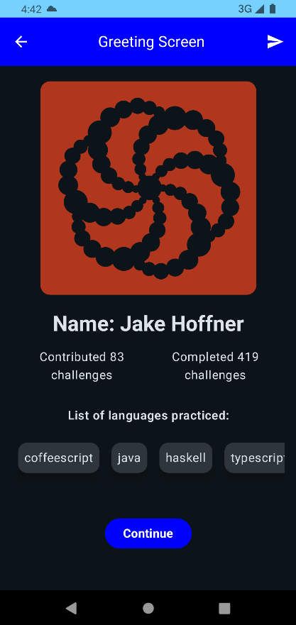
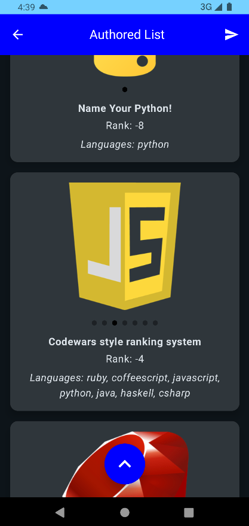
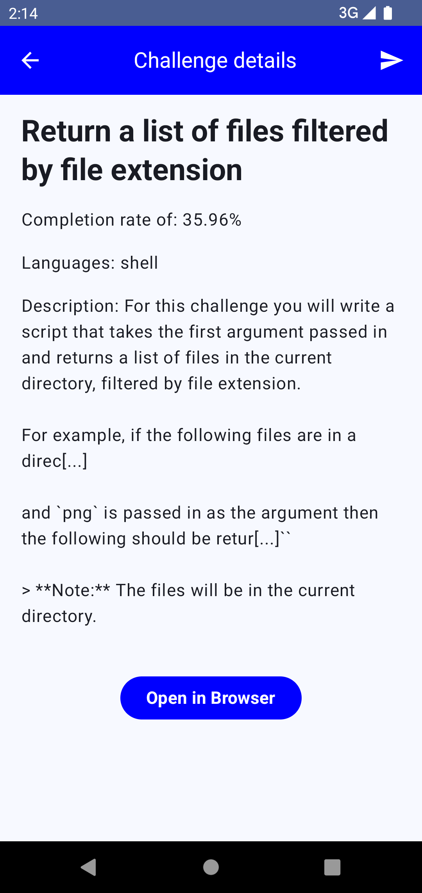

# TuiCodewars
Project Overview:

This project is built with API provided by CodeWars, for the position #2 on the leaderboard - jhoffner, uses the MVVM architecture, adhering to the principles of clean architecture. It leverages Jetpack Compose with Material3 design for a modern and responsive UI. Dependency injection is handled with Dagger/Hilt, and coroutines are used for asynchronous operations. The project includes robust loading state handling to ensure a smooth user experience during data fetching.

Key Libraries:

Jetpack Compose: Modern UI toolkit for building native Android UIs.

Material3: Material design components for Compose.

Dagger/Hilt: Dependency injection framework.

Coroutines: For managing background threads and asynchronous tasks.

Retrofit & Gson: For networking and JSON parsing.

OkHttp: For HTTP requests and logging.

Kotlinx Coroutines: For coroutine support.

JUnit & MockK: For unit testing and mocking.

Compose Destinations: For navigation in Compose.

