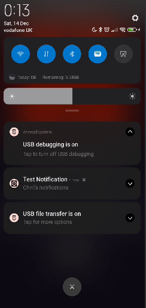
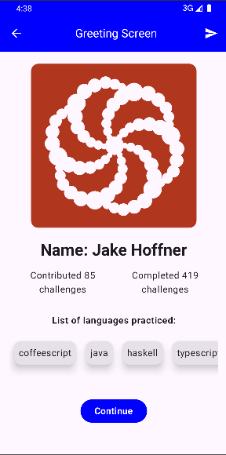
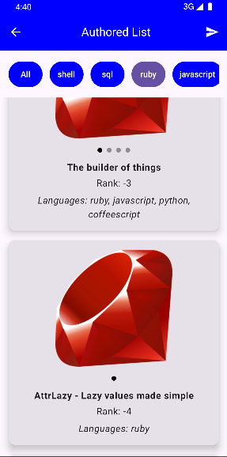
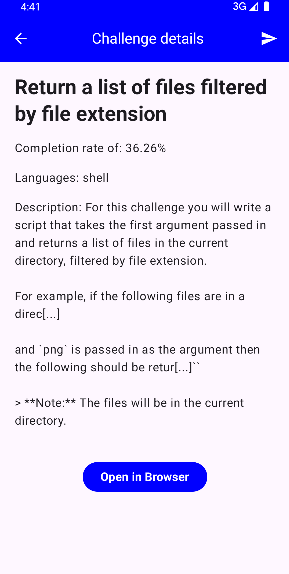
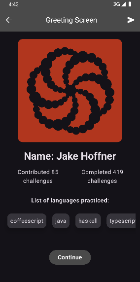
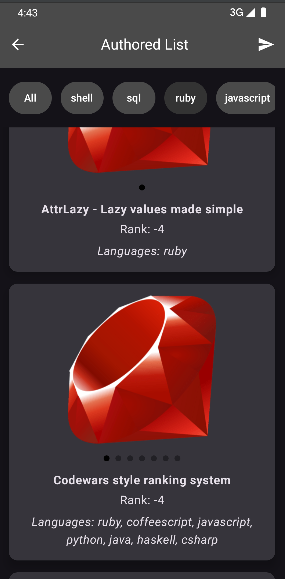
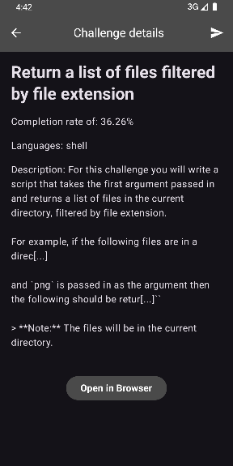
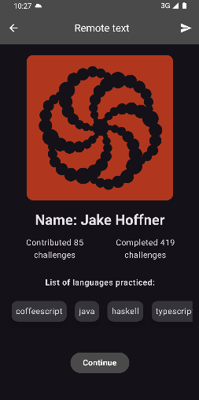

# TuiCodewars
Project Overview:

This project was created for the Android Developer position by Chiril Grituc, built with the open API provided by CodeWars in [CodeWars API Documentation](https://dev.codewars.com/), specifically for the position #2 on the leaderboard - Jhoffner. It follows the MVVM architecture and adheres to the principles of Clean Architecture. The app leverages Jetpack Compose with Material3 design for a modern and responsive UI and sorting. Dependency injection is handled with Dagger/Hilt, and coroutines are used for asynchronous operations.

The project includes comprehensive testing, utilizing both unit tests with JUnit and MockK, as well as integration tests to ensure the MainScreen functions correctly under various states (loading, success, error, and local data). Robust loading state handling is implemented to provide a smooth user experience during data fetching. Additionally, a local Room database is used to cache data for offline access, and a network checker avoids unnecessary network requests when the internet is unavailable.

To streamline dependency management, the project has been migrated to use a version catalog, simplifying the process of adding and updating libraries.

Key Libraries:

Jetpack Compose: Modern UI toolkit for building native Android UIs.

Material3: Material design components for Compose.

Dagger/Hilt: Dependency injection framework.

Coroutines: For managing background threads and asynchronous tasks.

Retrofit & Gson: For networking and JSON parsing.

OkHttp: For HTTP requests and logging.

Kotlinx Coroutines: For coroutine support.

Room: For local database caching.

Firebase Analytics: Integrated for tracking app usage, user interactions, and providing valuable insights to improve user engagement.

Firebase Cloud Messaging: Implemented to enable push notifications, delivering updates and alerts directly to the user.

Firebase Remote Config: Used for dynamic configuration changes, allowing real-time updates to app behavior without requiring an app update.

JUnit & MockK: For unit testing and mocking.

Compose Destinations: For navigation in Compose.

- **Notifications**:

- **Light Theme Screens**:

- **Dark Theme Screens**:

- **Remote Config Modified Title**:

